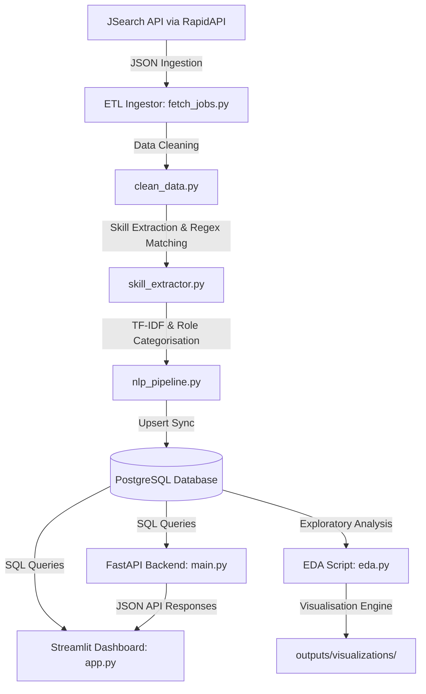

# AI-Powered Job Market Intelligence Platform

An end-to-end data engineering and machine learning analytics platform that fetches, cleans, enriches, and visualizes tech job postings in real time. The platform extracts industry skills, categorizes job roles using custom NLP rules, computes market statistics, and serves interactive insights through a **FastAPI backend** and a custom **Streamlit dashboard**.

---

## System Architecture & Workflow

The platform comprises an ingestion pipeline, database storage, analytics module, API service, and a web-based dashboard:



### Directory Structure

- `backend/` - FastAPI backend application and database engine configuration.
- `dashboard/` - Streamlit application logic and dark-themed styling configuration.
- `data_pipeline/` - Data ingestion, cleaning, keyword extraction, and NLP pipeline scripts.
- `database/` - Initial SQL schema definitions.
- `analytics/` - Calculations for metrics, command-line exploratory data analysis (EDA), and static visualization engines.
- `tests/` - Comprehensive unit test suite.
- `outputs/` - Generated Matplotlib (PNG) and Plotly (HTML) charts.

---

## Core Features

- **Automated Ingest & Cleanup**: Incremental ETL pipeline that fetches real-time jobs, resolves schema drift, standardizes text fields, and tracks metrics.
- **Skill Extraction**: Custom pattern matcher mapping job description bodies to a curated master list of over 70+ technologies (languages, frameworks, DBs, cloud services, DevOps tools).
- **NLP Role Classification**: Categorizes job listings into precise fields (e.g., _Data Scientist, ML Engineer, AI Engineer, Data Engineer, DevOps, Backend Developer, Full Stack Developer, Software Engineer_) using domain-specific rule hierarchies.
- **TF-IDF Keyword Extraction**: Runs term frequency-inverse document frequency vectors on descriptions to highlight the most relevant keywords per listing.
- **Interactive Streamlit Dashboard**: Dark-mode analytics UI built with Plotly. Contains charts detailing hiring locations, top hiring companies, remote work distributions, role metrics, and custom salary boxes/strip plots.
- **REST API Layer**: FastAPI service exposing structured data quality, market distributions, skills, and manual pipeline trigger endpoints.
- **Unit Tests**: Robust validation covering text processing, classification, aggregation math, and data cleansing.

---

## Technology Stack

- **Languages**: Python 3.11
- **Web Framework & API**: FastAPI, Uvicorn
- **Frontend Dashboard**: Streamlit, Plotly (Interactive), Matplotlib (Static)
- **Data Processing & NLP**: Pandas, NumPy, Scikit-learn (TF-IDF Vectorizer), Re (Regex Matching)
- **Database Engine**: PostgreSQL 15, SQLAlchemy
- **Containerization & DevOps**: Docker, Docker Compose
- **Testing**: Pytest

---

## Quick Start (Docker Compose)

The easiest way to spin up the entire system (Database, Pipeline, Backend, and Streamlit Dashboard) is using Docker Compose.

### 1. Configure Environment Variables

Copy `.env.example` to `.env` and configure your credentials. You will need a free RapidAPI key for JSearch.

```bash
cp .env.example .env
```

Inside `.env`, make sure to set:

- `RAPIDAPI_KEY`: Your RapidAPI credentials.
- `DB_HOST=db` (Crucial for Docker containers to talk over the shared network).

### 2. Build and Launch Containers

```bash
docker-compose up --build
```

**What happens on startup:**

1.  **`db` service**: Spins up PostgreSQL 15. The schema in [schema.sql](file:///c:/Users/ASUS/OneDrive/Desktop/job-market-intelligence-platform/database/schema.sql) is executed automatically on first initialization.
2.  **`pipeline` service**: Executes the fetch, cleanup, skill extraction, and NLP categorization scripts sequentially, populating the database, then safely shuts down.
3.  **`app` service**: Starts the Streamlit dashboard server.

Once running, navigate to **`http://localhost:8501`** in your browser to view the interactive dashboard.

---

## Local Development (Non-Docker Setup)

If you prefer to run services individually without Docker, follow these steps:

### 1. Set Up Python Virtual Environment

```powershell
# Create environment
python -m venv venv

# Activate on Windows
.\venv\Scripts\activate

# Install dependencies
pip install -r requirements.txt
```

### 2. Configure Database

- Install PostgreSQL locally and create a database named `job_market_db`.
- Run the schema script in your database GUI or via CLI:
  ```bash
  psql -U postgres -d job_market_db -f database/schema.sql
  ```
- Update your `.env` to connect locally:
  ```ini
  DB_HOST=localhost
  DB_PORT=5432
  DB_NAME=job_market_db
  DB_USER=postgres
  DB_PASSWORD=your_postgres_password
  RAPIDAPI_KEY=your_jsearch_api_key
  RAPIDAPI_HOST=jsearch.p.rapidapi.com
  ```

### 3. Run Pipeline Scripts

You can run the pipeline sequentially from the root workspace directory:

```bash
# Step 1: Fetch and clean job data from API
python -m data_pipeline.fetch_jobs

# Step 2: Extract skills from job descriptions
python -m data_pipeline.skill_extractor

# Step 3: Run NLP model categories and TF-IDF keywords
python -m data_pipeline.nlp_pipeline
```

### 4. Start the REST API

Run the FastAPI web server:

```bash
uvicorn backend.main:app --reload
```

Interactive docs will be available at:

- Swagger UI: [http://localhost:8000/docs](http://localhost:8000/docs)
- ReDoc: [http://localhost:8000/redoc](http://localhost:8000/redoc)

### 5. Start the Streamlit Dashboard

```bash
streamlit run dashboard/app.py
```

Open **`http://localhost:8501`** in your web browser.

---

## Command-Line EDA & Visualizations

To run Exploratory Data Analysis and generate static charts locally:

```bash
python -m analytics.eda
```

This script runs database aggregations and generates high-fidelity dark-themed charts saved to `outputs/visualizations/`:

- `top_hiring_cities.png` - Matplotlib horizontal bar chart.
- `top_hiring_companies.html` - Plotly interactive bar chart.
- `employment_type_distribution.html` - Plotly interactive donut chart.
- `remote_vs_onsite.png` - Matplotlib comparison bar chart.
- `salary_distribution.html` - Plotly box and strip plot.
- `data_quality.png` - Matplotlib missing value quality chart.
- `title_keywords.png` - Matplotlib keyword frequencies.

---

## 📡 API Endpoint Reference

| Method   | Endpoint                    | Description                                                            |
| :------- | :-------------------------- | :--------------------------------------------------------------------- |
| **GET**  | `/health`                   | DB connection and health check status.                                 |
| **GET**  | `/jobs`                     | Retrieve job listings with filters (city, type, remote, salary, role). |
| **GET**  | `/jobs/{job_id}`            | Detailed data for a specific job listing.                              |
| **GET**  | `/metrics/cities`           | Top hiring cities count.                                               |
| **GET**  | `/metrics/companies`        | Top hiring companies count.                                            |
| **GET**  | `/metrics/employment-types` | Count distribution of FULLTIME, CONTRACTOR, etc.                       |
| **GET**  | `/metrics/remote`           | Breakdown of Remote vs On-site vacancies.                              |
| **GET**  | `/metrics/salary`           | Average salary stats and reporting volume.                             |
| **GET**  | `/metrics/data-quality`     | Missing value percentage per column.                                   |
| **GET**  | `/insights/skills`          | Ranking of extracted skills from job description text.                 |
| **GET**  | `/insights/roles`           | Breakdown of jobs mapped to NLP categories.                            |
| **GET**  | `/insights/skills-by-role`  | Top 5 technical skills sorted per role category.                       |
| **POST** | `/pipeline/run`             | Triggers the ingestion and NLP pipelines synchronously.                |

---

## Testing

Run unit tests locally via `pytest` to verify logic across pipeline cleaning, skill classification, and database calculations:

```bash
python -m pytest tests/
```

The test suite utilizes mocks for API integrations and database connections to run isolated tests within `tests/test_pipeline.py`.
